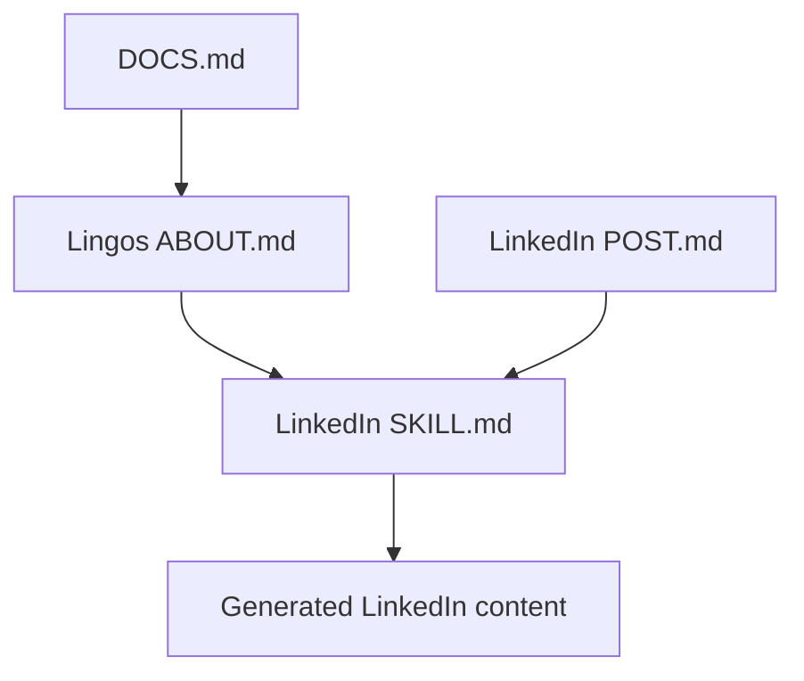

# Repository Context

| Area | Location | Purpose |
|---|---|---|
| Project rules | `AGENTS.md` | Essential repository guidance |
| Documentation rules | `DOCS.md` | How knowledge is written and maintained |
| Lingos knowledge | `.codex/skills/lingos/skills/` | Facts and context about Lingos |
| LinkedIn guidance | `.codex/skills/linkedin/skills/` | How Lingos knowledge becomes LinkedIn content |
| Configuration | `.codex/config.toml` | Codex configuration; preserve unless explicitly requested |

## Working principles

- Understand the existing structure and behavior before acting; preserve what works and avoid duplication.
- Keep work moving with reasonable assumptions instead of unnecessary questions or repetition.
- Ask before making a change that is ambiguous, destructive, external, or materially different from the request.
- Keep communication and changes concise, purposeful, and relevant to the current context.
